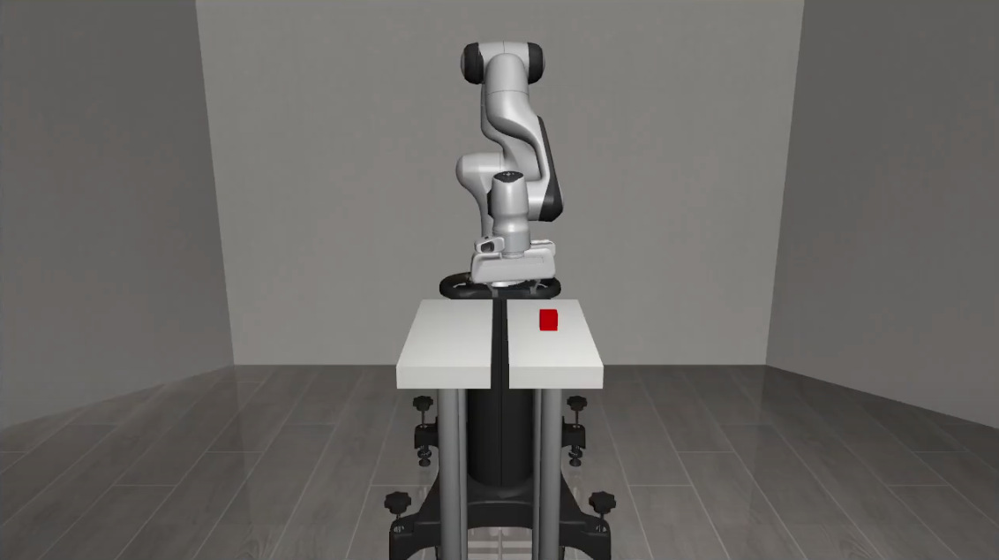

# 🤖 Robot Arm Learning Task – FEUP

This project involves training a robotic arm using **Reinforcement Learning** (Proximal Policy Optimization – PPO) with the `robosuite` simulator to grasp a cube and move it to another location (another table surface). Developed as part of a robotics and AI course at **FEUP**.



---

## 📁 Project Structure
```
Root/
├── DLR/
│   └── network.py              # PPO agent and network
├── env/
│   └── PickMove.py             # Custom environment
├── models/                     # Saved models (checkpoints, final_model.pth)
├── run.py                      # Training execution script
├── check.py                    # Model evaluation / debugging
├── requirements.txt            # Dependencies
├── README.txt                  # This file
└── .gitignore                  # Git ignore list
```

## 📦 Dependencies

To install all required packages:
```
pip install -r requirements.txt
```
Minimum required packages:
- robosuite==1.4.0
- torch
- numpy
- matplotlib

**Important**: To install `robosuite` and `robosuite_models` correctly, please follow the official installation steps here:

👉 https://robosuite.ai/docs/installation.html

This ensures that MuJoCo and all simulation dependencies are configured properly.

---


1. Train the agent:
```
   python run.py
```

2. Optional: Evaluate model performance:
```
   python check.py
```
3. Output graphs:
   - reward_curve.png – Total reward per episode
   - loss_curve.png – PPO training loss
   - value_vs_return.png – Critic value estimation accuracy
   - reward_components.png – Optional: tracks reach, grasp, and place rewards

4. Model checkpoints are saved in the `models/` directory:
   - best_model.pth
   - final_model.pth
   - checkpoint_XXX.pth (if periodic saves are enabled)

To resume training from a checkpoint:

agent.load_model('models/best_model.pth')

---

## 📂 Source Code Description

- `env/PickMove.py` – Custom environment with reward shaping and task logic.
- `DLR/network.py` – PPOAgent class with actor-critic networks and training.
- `run.py` – Main training loop.
- `check.py` – Evaluation and rendering (optional).
- `requirements.txt` – Dependency list.

---

## 👥 Authors & Institution

- Author(s): João A. C. Viveiros, Santiago Romero Pineda, Gonçalo P. N. de Pinho, Michał Dawid Kowalski
- Course: Deep Learning for Robotics
- Institution: FEUP – Faculdade de Engenharia da Universidade do Porto
- Date: June 2025

---

## 📘 Notes

- You can fine-tune a trained model by adjusting the reward function in `PickMove.py`.
- Logs and reward components help diagnose grasping and placing performance.
  
---
